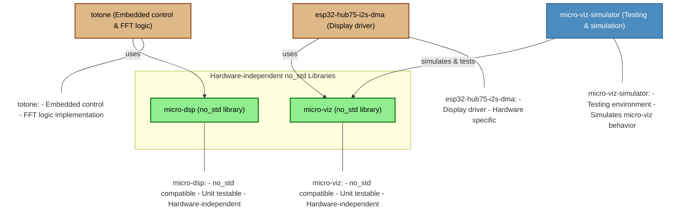

```mermaid
graph TD
    %% Define the main components
    totone["totone (Embedded control & FFT logic)"]
    esp32["esp32-hub75-i2s-dma (Display driver)"]
    dsp["micro-dsp (no_std library)"]
    viz["micro-viz (no_std library)"]
    sim["micro-viz-simulator (Testing & simulation)"]
    
    %% Define relationships
    totone -->|uses| dsp
    esp32 -->|uses| viz
    sim -->|simulates & tests| viz
    
    %% Add subgraph for the no_std libraries
    subgraph "Hardware-independent no_std Libraries"
        dsp
        viz
    end
    
    %% Add notes about the libraries
    classDef noStd fill:#90ee90,stroke:#006400,stroke-width:2px,color:black;
    classDef application fill:#deb887,stroke:#8b4513,stroke-width:2px,color:black;
    classDef tester fill:#4b8bbe,color:white,stroke:#306998,stroke-width:2px;
    
    class dsp,viz noStd;
    class totone,esp32 application;
    class sim tester;
    
    %% Add descriptions
    dspLabel["micro-dsp: - no_std compatible - Unit testable - Hardware-independent"]
    vizLabel["micro-viz: - no_std compatible - Unit testable - Hardware-independent"]
    totoneLabel["totone: - Embedded control - FFT logic implementation"]
    esp32Label["esp32-hub75-i2s-dma: - Display driver - Hardware specific"]
    simLabel["micro-viz-simulator: - Testing environment - Simulates micro-viz behavior"]
    
    dsp --- dspLabel
    viz --- vizLabel
    totone --- totoneLabel
    esp32 --- esp32Label
    sim --- simLabel
    
    %% Use transparent style for labels
    classDef label fill:none,stroke:none;
    class dspLabel,vizLabel,totoneLabel,esp32Label,simLabel label;
```