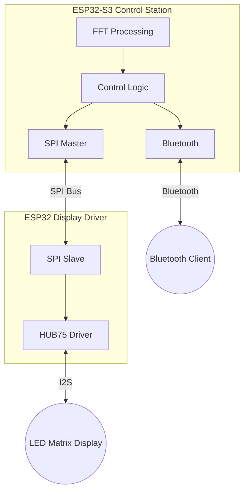

```mermaid
graph
    subgraph ESP32-S3[ESP32-S3 Control Station]
        FFT[FFT Processing]
        BT[Bluetooth]
        SPIM[SPI Master]
        CTRL[Control Logic]
    end
    
    subgraph ESP32[ESP32 Display Driver]
        SPIS[SPI Slave]
        HUB[HUB75 Driver]
    end

    %% Connections within ESP32-S3
    FFT --> CTRL
    CTRL --> SPIM
    CTRL --> BT
    
    %% Connections within ESP32
    SPIS --> HUB
    
    %% SPI Connection between devices
    SPIM <--> |SPI Bus| SPIS

    %% External connections
    BT <--> |Bluetooth| BTClient((Bluetooth Client))
    HUB <--> |I2S| LEDMatrix((LED Matrix Display))
```