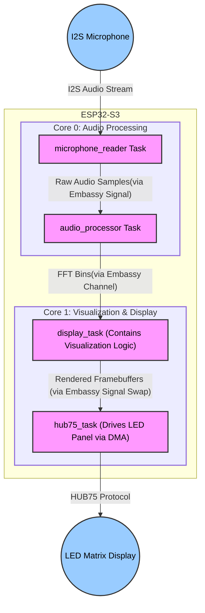

```mermaid
graph TD
    %% Define External Hardware
    Microphone((I2S Microphone))
    LEDMatrix((LED Matrix Display))

    %% Define the main ESP32-S3 System
    subgraph System [ESP32-S3]
        direction LR

        %% --- Core 0 handles audio input and processing ---
        subgraph Core0 [Core 0: Audio Processing]
            direction TB
            MicReader["microphone_reader Task"]
            AudioProc["audio_processor Task"]
        end

        %% --- Core 1 handles visualization logic and display output ---
        subgraph Core1 [Core 1: Visualization & Display]
            direction TB
            DisplayTask["display_task (Contains Visualization Logic)"]
            Hub75Task["hub75_task (Drives LED Panel via DMA)"]
        end
    end

    %% --- Define Data Flow Between All Components ---
    Microphone -- "I2S Audio Stream" --> MicReader
    MicReader -- "Raw Audio Samples(via Embassy Signal)" --> AudioProc
    AudioProc -- "FFT Bins(via Embassy Channel)" --> DisplayTask
    DisplayTask -- "Rendered Framebuffers (via Embassy Signal Swap)" --> Hub75Task
    Hub75Task -- "HUB75 Protocol" --> LEDMatrix


    %% --- Styling ---
    classDef core fill:#ececff,stroke:#9370db,stroke-width:2px;
    classDef task fill:#f9f,stroke:#333,stroke-width:2px,color:#000;
    classDef hardware fill:#9cf,stroke:#333,stroke-width:2px,color:#000;

    class Core0,Core1 core;
    class MicReader,AudioProc,DisplayTask,Hub75Task task;
    class Microphone,LEDMatrix hardware;
```